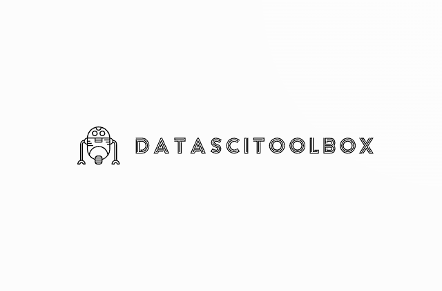

  <a href="#Introducción">Introducción</a> •
  <a href="#Estructura-repositorio.">Estructura repositorio.</a> •
  <a href="#Variables.">Variables.</a> •

  

<h2 id="Introducción"> :pencil: Introducción</h2>

Bienvenido/a a DataSciToolbox

Le damos la bienvenida a la biblioteca de funciones en Python orientadas a machine learning, recopilada por los alumnos de la promoción de abril a agosto de 2023 del bootcamp de Data Science de The Bridge, Digital Talent Accelerator.

En ella, encontrará un extensivo repositorio que abarca todas las fases necesarias para afrontar un proyecto de machine learning, desde el análisis exploratorio de datos hasta la evaluación de los modelos, pasando por las etapas de preprocesamiento, visualización, feature engineering o entrenamiento y evaluación de los modelos.
